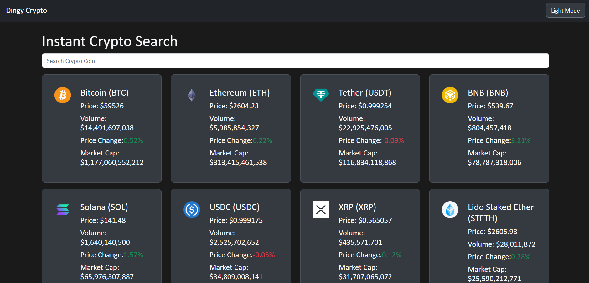

# Dingy Crypto Tracker



Dingy Crypto Tracker is a real-time cryptocurrency tracking application that provides live updates on your favorite digital currencies. Stay informed about the latest trends, prices, and market capitalizations in the crypto world.

## 🚀 Live Demo

Experience Dingy Crypto Tracker in action: [LIVE](https://crpyto-tracker.vercel.app/)

## ✨ Features

- Real-time tracking of cryptocurrency prices
- Detailed information on market cap, volume, and price changes
- User-friendly interface with responsive design
- Dark mode for comfortable viewing in low-light environments
- Upcoming feature: Integrated crypto news feed

## 🛠️ Built With

- [React.js](https://reactjs.org/) - A JavaScript library for building user interfaces
- CSS - For styling and responsive design
- RESTful API - For fetching real-time cryptocurrency data

## 🏗️ Installation

To get Dingy Crypto Tracker running locally on your machine, follow these steps:

1. Clone the repository:
   ```bash
   git clone https://github.com/Dungyy/dingy-crypto-tracker.git
   ```
   ```
   cd dingy-crypto-tracker
   ```
1. Install dependencies:
      ```
   npm install
   ```
1. Start the development server:  
      ```
   npm start
   ```
1. Start the development server:  
      ```
   http://localhost:3000
   ```   

## 🙏 Acknowledgments

CoinGecko API for providing cryptocurrency data
React Icons for the beautiful icons
Netlify for hosting the live demo   